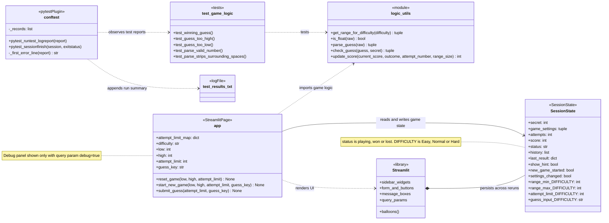

# Architecture

Raw diagram source for mermaid.live: [architecture.mmd](architecture.mmd)

```mermaid
classDiagram
    direction LR

    class app {
        <<StreamlitPage>>
        +attempt_limit_map: dict
        +difficulty: str
        +low: int
        +high: int
        +attempt_limit: int
        +guess_key: str
        +reset_game(low, high, attempt_limit) None
        +start_new_game(low, high, attempt_limit, guess_key) None
        +submit_guess(attempt_limit, guess_key) None
    }

    class logic_utils {
        <<module>>
        +get_range_for_difficulty(difficulty) tuple
        +is_float(raw) bool
        +parse_guess(raw) tuple
        +check_guess(guess, secret) tuple
        +update_score(current_score, outcome, attempt_number, range_size) int
    }

    class SessionState {
        <<SessionState>>
        +secret: int
        +game_settings: tuple
        +attempts: int
        +score: int
        +status: str
        +history: list
        +last_result: dict
        +show_hint: bool
        +new_game_started: bool
        +settings_changed: bool
        +range_min_DIFFICULTY: int
        +range_max_DIFFICULTY: int
        +attempt_limit_DIFFICULTY: int
        +guess_input_DIFFICULTY: str
    }

    class Streamlit {
        <<library>>
        +sidebar_widgets
        +form_and_buttons
        +message_boxes
        +query_params
        +balloons()
    }

    class test_game_logic {
        <<tests>>
        +test_winning_guess()
        +test_guess_too_high()
        +test_guess_too_low()
        +test_parse_valid_number()
        +test_parse_strips_surrounding_spaces()
    }

    class conftest {
        <<pytestPlugin>>
        -_records: list
        +pytest_runtest_logreport(report)
        +pytest_sessionfinish(session, exitstatus)
        -_first_error_line(report) str
    }

    class test_results_txt {
        <<logFile>>
    }

    app ..> logic_utils : imports game logic
    app --> SessionState : reads and writes game state
    app ..> Streamlit : renders UI
    Streamlit *-- SessionState : persists across reruns
    test_game_logic ..> logic_utils : tests
    conftest ..> test_game_logic : observes test reports
    conftest ..> test_results_txt : appends run summary

    note for SessionState "status is playing, won or lost. DIFFICULTY is Easy, Normal or Hard"
    note for app "Debug panel shown only with query param debug=true"
```
